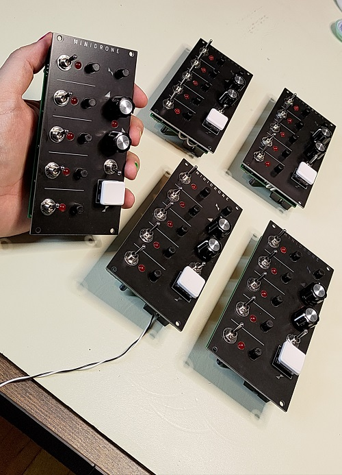

# Minidrone

Minidrone is a drone module with a built in Attack/Release amp envelope. It contains five sawtooth oscillators each with individual pitch control and an enable switch. A master pitch control can adjust the tuning of all voices at once. 

Loosely inspired on the Elta Music Solar50

## Case

- 1/2" x 3.5" sheet
  - 2 @ 6.25"
  - 2 @ 13.8"
- 1/4" x 2.5" sheet
  - 2 @ 13.8"
- 1/2" ply
  - 1 @ 13.8" x 5.25"
